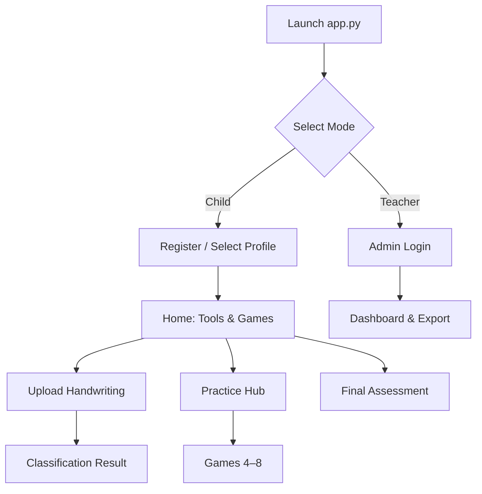

# Learning Disability Detection & Support System

> A child-friendly, accessible multi-model AI platform for handwriting-based screening and adaptive cognitive learning support — built with Streamlit and PyTorch.

---

## Overview

This graduation project combines **deep learning classification** of handwritten samples with an interactive **learning support layer** of cognitive games. Children practice through playful, dyslexia-aware UI; teachers and parents monitor progress through a secure dashboard with charts, history, and CSV export.

The system is designed around two principles:

1. **Child safety** — No diagnostic labels are shown to children; feedback stays encouraging and age-appropriate.
2. **Accessibility first** — OpenDyslexic font, high contrast, large touch targets, light/dark themes, and clear instructional text throughout.

---

## Table of Contents

- [Features](#features)
- [Architecture](#architecture)
- [Tech Stack](#tech-stack)
- [Project Structure](#project-structure)
- [Prerequisites](#prerequisites)
- [Installation](#installation)
- [Configuration](#configuration)
- [Running the Application](#running-the-application)
- [Testing & Verification](#testing--verification)
- [Machine Learning Models](#machine-learning-models)
- [Database & Analytics](#database--analytics)
- [Accessibility & UX](#accessibility--ux)
- [Known Limitations](#known-limitations)
- [Documentation](#documentation)
- [Disclaimer](#disclaimer)

---

## Features

### Two Operating Modes

| Mode | Audience | Capabilities |
|------|----------|--------------|
| **Child Mode** | Children (ages 4–18) | Handwriting upload, cognitive games, star rewards, anonymous or named profiles |
| **Teacher / Parent Mode** | Educators & caregivers | Secure login, per-child analytics, session history, rename/delete accounts, CSV export |

### Core Modules

#### Handwriting Classification (Tabs 1–2)

- Upload handwriting images (camera, file, or drag-and-drop)
- Run inference with **CNN**, **MobileNet V3 Large**, or **EfficientNet-B0**
- View child-safe results on the Classification Result page
- Optional teacher-facing confidence and model comparison details
- Results persisted to SQLite for longitudinal tracking

#### Learning Support Hub (Tab 3)

Central practice hub showing stars earned, recent activity, and quick links to all games.

#### Cognitive Support Games (Tabs 4–8)

| Tab | Module | What it measures |
|-----|--------|------------------|
| **4** | Attention & Focus | Age-based focus duration, countdown timer, target-letter search |
| **5** | Visual Memory | Grid recall with configurable display time and difficulty levels |
| **6** | Auditory Memory | Listen-and-repeat tone sequences (phonological loop) |
| **7** | Working Memory | Forward / backward digit span trials |
| **8** | Processing Speed | Same/different, color matching, and pattern recognition under time pressure |

#### Final Assessment (Tab 9)

A composite **Final Challenge** that walks through six mini-tasks (attention, visual memory, auditory memory, word memory, working memory, processing speed) and produces a 0–100 cognitive profile saved to the database.

#### Teacher Dashboard

- Child profile (name, ID, age, last activity)
- Rename anonymous `Friend-XXXX` placeholder accounts
- Overview progress chart across all activities (Plotly)
- Per-module session history with trend lines and raw data tables
- Delete individual sessions or entire child records
- Export all progress to CSV

---

## Architecture

```
┌─────────────────────────────────────────────────────────────────────────┐
│                         Streamlit Application (app.py)                  │
├──────────────────────────────┬──────────────────────────────────────────┤
│         Child Mode           │         Teacher / Parent Mode            │
│  Registration · Games · Stars│  Auth · Dashboard · Charts · Export      │
└──────────────┬───────────────┴──────────────────┬───────────────────────┘
               │                                   │
               ▼                                   ▼
┌──────────────────────────┐          ┌──────────────────────────┐
│   pages/ (multi-page)    │          │   database/db_handler  │
│   1 Upload → 2 Result    │◄────────►│   SQLite (persistent)  │
│   3 Hub → 4–9 Games      │          │   users · stars · logs │
└──────────────┬───────────┘          └──────────────────────────┘
               │
               ▼
┌──────────────────────────┐          ┌──────────────────────────┐
│   models/model_loader    │          │   utils/                 │
│   CNN · MobileNet · EffNet│          │   auth · theme · audio   │
│   + .pth checkpoints     │          │   image_processing · log │
└──────────────────────────┘          └──────────────────────────┘
               ▲
               │  Offline training
┌──────────────────────────┐
│   Notebooks/             │
│   Final code.ipynb · …   │
└──────────────────────────┘
```

### User Flow



See [`SYSTEM_ARCHITECTURE_TABS.md`](SYSTEM_ARCHITECTURE_TABS.md) for the full mapping between architecture layers and Streamlit pages.

---

## Tech Stack

| Layer | Technology |
|-------|------------|
| Frontend / UI | [Streamlit](https://streamlit.io/) 1.31 |
| Deep Learning | [PyTorch](https://pytorch.org/) 2.1, [torchvision](https://pytorch.org/vision/) 0.16 |
| Image Processing | Pillow, OpenCV |
| Analytics & Charts | pandas, Plotly (teacher dashboard) |
| Database | SQLite (built-in, persistent on disk) |
| Testing | pytest 8 |
| Typography | OpenDyslexic (CDN) |

---

## Project Structure

```
Grad project/
├── app.py                          # Main entry: mode selector, child home, teacher dashboard
├── requirements.txt
├── README.md
│
├── pages/                          # Streamlit multi-page routes
│   ├── 1_Upload_Handwriting.py     # Image upload & model selection
│   ├── 2_Classification_Result.py  # Inference results & feedback
│   ├── 3_Learning_Support.py       # Practice hub
│   ├── 4_Attention_Focus.py
│   ├── 5_Visual_Memory.py
│   ├── 6_Auditory_Memory.py
│   ├── 7_Working_Memory.py
│   ├── 8_Processing_Speed.py
│   └── 9_Final_Assessment.py       # Composite cognitive assessment
│
├── models/
│   ├── cnn_model.py                # Custom CNN architecture
│   ├── mobilenet_model.py          # MobileNet V3 Large head
│   ├── efficientnet_model.py       # EfficientNet-B0 head
│   ├── model_loader.py             # Unified inference & checkpoint loading
│   └── *.pth                       # Trained weights (not in repo — see below)
│
├── database/
│   ├── db_handler.py               # SQLite CRUD, progress, export
│   └── learning_support.db         # Auto-created at runtime
│
├── utils/
│   ├── auth.py                     # Constant-time credential verification
│   ├── session_manager.py          # Child session & page tracking
│   ├── theme.py                    # Light / dark mode
│   ├── image_processing.py         # Preprocessing pipeline
│   ├── audio.py                    # Tone & speech queues for memory games
│   └── logger.py                   # Structured logging
│
├── tests/                          # pytest suite
├── scripts/
│   ├── smoke_check.py              # Pre-flight system verification
│   └── tc_edge_verify.py
│
├── Notebooks/                      # Offline model training & evaluation
├── Paper/                          # Thesis / paper generation scripts
├── weights/                        # Documentation for weight placement
├── assets/                         # Static assets
└── .streamlit/
    └── secrets.toml.example        # Admin credential template
```

---

## Prerequisites

- **Python 3.8+** (3.10+ recommended)
- **pip** and a virtual environment tool (`venv`, `conda`, etc.)
- **~2 GB disk space** for PyTorch and model weights
- **Optional:** CUDA-capable GPU for faster inference (CPU works fine)

---

## Installation

### 1. Clone or download the project

```bash
cd "Grad project"
```

### 2. Create and activate a virtual environment

**Windows (PowerShell):**

```powershell
python -m venv .venv
.\.venv\Scripts\Activate.ps1
```

**macOS / Linux:**

```bash
python3 -m venv .venv
source .venv/bin/activate
```

### 3. Install dependencies

```bash
pip install -r requirements.txt
pip install plotly
```

> Plotly is used by the teacher dashboard charts. Install it explicitly if charts fail to render.

### 4. Add model weights

Place trained checkpoints in the `models/` folder:

| Model | Required filename |
|-------|-------------------|
| Custom CNN | `cnn_classifier (2).pth` |
| MobileNet V3 Large | `mobilenet_v3_large_classifier.pth` |
| EfficientNet-B0 | `efficientnet_b0_classifier (1).pth` |

See [`weights/README.md`](weights/README.md) for checkpoint format details and troubleshooting.

> **Without weights:** Models initialize with random parameters so the UI and workflow still run for demonstration — predictions will not be meaningful until real checkpoints are added.

---

## Configuration

### Teacher / Parent credentials

Copy the example secrets file and customize:

```bash
cp .streamlit/secrets.toml.example .streamlit/secrets.toml
```

```toml
ADMIN_USERNAME = "admin"
ADMIN_PASSWORD = "YourSecurePassword"
```

Default demo credentials (used when no secrets file exists):

| Field | Value |
|-------|-------|
| Username | `admin` |
| Password | `Teacher@123` |

> Change these before any production or shared deployment.

---

## Running the Application

```bash
streamlit run app.py
```

The app opens at **http://localhost:8501**.

### Quick start walkthrough

1. **Choose Child Mode** → create a profile or tap *Skip — just play!*
2. **Check My Writing** → upload a handwriting sample → view results
3. **My games** → try Focus, Memory, or Quick Think modules
4. **Switch to Teacher Mode** → log in → select a child → review charts and export CSV

---

## Testing & Verification

### Run the test suite

```bash
pytest tests/ -v
```

| Test file | Coverage |
|-----------|----------|
| `test_auth_logic.py` | Teacher credential verification |
| `test_database.py` | SQLite CRUD and progress queries |
| `test_image_processing.py` | Preprocessing pipeline |
| `test_model_loader.py` | Model loading and inference |
| `test_scoring.py` | Game scoring logic |

### Pre-flight smoke check

Validates database round-trips, image processing, auth, and weight availability:

```bash
python scripts/smoke_check.py
```

Exit code `0` = all critical checks passed.

---

## Machine Learning Models

Three architectures classify handwriting as **Non-Dyslexic** vs **Dyslexic** (binary display; CNN internally uses a 3-class head mapped to binary):

| Model | Input | Size | Notes |
|-------|-------|------|-------|
| **Custom CNN** | Grayscale | 28×28 | 3-class checkpoint → binary via class aggregation |
| **MobileNet V3 Large** | Grayscale (padded) | 224×224 | Transfer learning with custom classifier head |
| **EfficientNet-B0** | Grayscale (padded) | 224×224 | Transfer learning with custom classifier head |

Training notebooks live in `Notebooks/` (see `Final code.ipynb`). Label mapping and checkpoint conventions are documented in `models/model_loader.py`.

### Inference pipeline

```
Upload → EXIF correction → Grayscale → Resize / pad → Normalize → Model → Softmax → Child-safe label
```

---

## Database & Analytics

- **Engine:** SQLite (`database/learning_support.db`)
- **Persistence:** Data survives app restarts; tables use `CREATE IF NOT EXISTS` only (no destructive startup)
- **Entities:** parents, users (children), classification results, per-module session results, stars, final assessments
- **Export:** Teacher dashboard → *Export All Progress to CSV*

Key API surface: `database/db_handler.py` → `DatabaseHandler`

---

## Accessibility & UX

- **OpenDyslexic** font with increased letter-spacing and line-height
- **High-contrast** instructional text (black on white in light mode)
- **Large buttons** and touch-friendly game layouts
- **Light / dark theme** toggle on every page (sidebar)
- **Star reward system** for positive reinforcement
- **Anonymous play** — children can start without typing a name; teachers rename later
- **No diagnostic jargon** shown to children

---

## Known Limitations

### Transformation invariance (handwriting models)

When models correctly classify real handwriting, they often misclassify **reversed or transformed** versions of the same letters. Tuning for reversed letters can degrade performance on normal samples. The models tend to rely on low-level visual cues (orientation, stroke direction, pixel layout) rather than transformation-invariant dyslexia-related writing patterns.

### Scope of the system

- This is a **research / graduation prototype**, not a clinical diagnostic tool.
- Cognitive games provide **practice and screening signals**, not formal neuropsychological assessment.
- Single-device SQLite storage — not designed for multi-tenant cloud deployment without modification.

---

## Documentation

| Document | Description |
|----------|-------------|
| [`SYSTEM_ARCHITECTURE_TABS.md`](SYSTEM_ARCHITECTURE_TABS.md) | Architecture layer → Streamlit tab mapping |
| [`SYSTEM_DESIGN_IMAGE_PROMPT.md`](SYSTEM_DESIGN_IMAGE_PROMPT.md) | Prompt for generating architecture diagrams |
| [`weights/README.md`](weights/README.md) | Model weight formats and troubleshooting |

---

## Disclaimer

This software is intended for **educational and research purposes** only. It does **not** replace professional medical, psychological, or educational evaluation. Always consult qualified specialists for learning disability diagnosis and intervention planning.

---

<p align="center">
  <strong>Built with care for learners who deserve accessible, encouraging technology.</strong>
</p>
